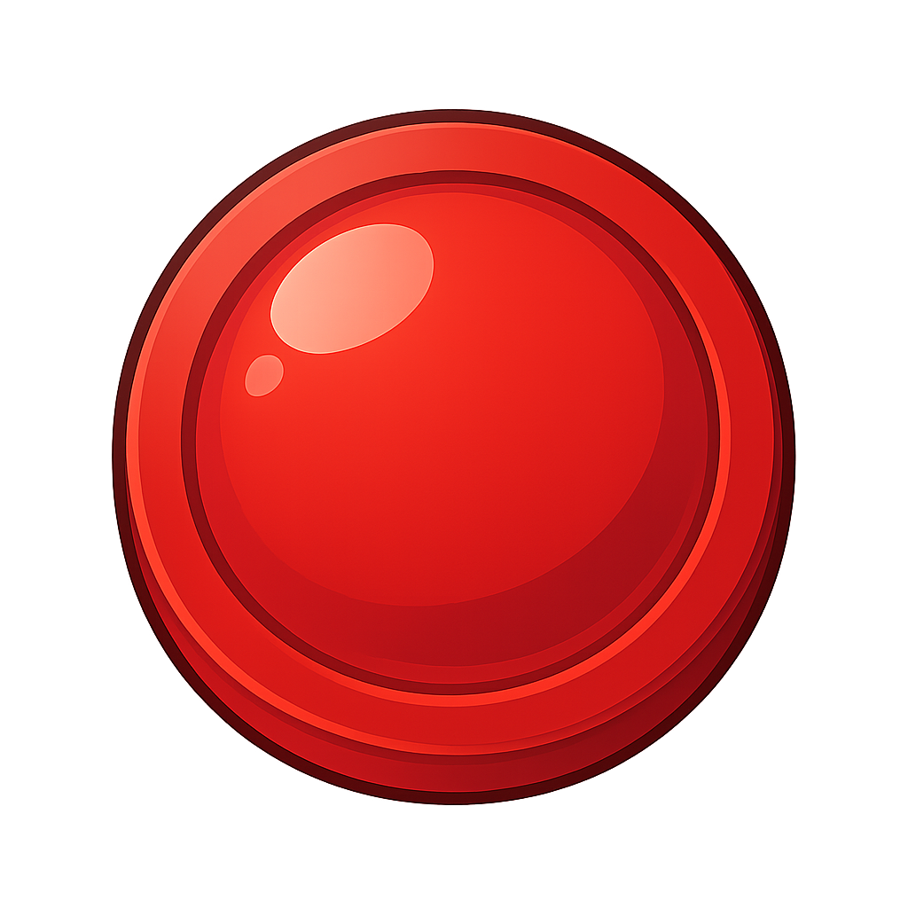
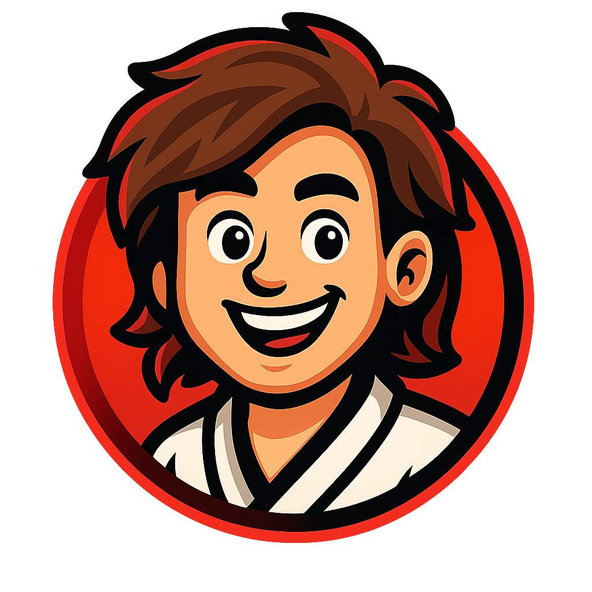

# Connect 4 - Online Multiplayer Game

A real-time, browser-based multiplayer Connect 4 game built with Node.js and Socket.IO. This project features a clean user interface, real-time chat, character avatars, and a persistent leaderboard.

**🚀 Live Demo: [cdrz.app](https://cdrz.app)**

## Features

-   🎮 **Real-time Multiplayer:** Play with friends over the internet in private rooms.
-   🆔 **Prominent Room Code Panel:** Easy-to-spot status panel above chat shows connection state and room code.
-   💬 **Game Chat:** Communicate with your opponent in real-time during the game.
-   🧑‍� **Character Avatars:** Custom illustrated avatars replace plain colored discs for player identity.
-   �🏆 **Persistent Leaderboard:** Tracks player wins and win rates.
-   🎨 **Modern & Responsive UI:** Compact desktop layout keeps board and chat side‑by‑side; mobile view stacks cleanly.
-   ✨ **Animated Gameplay:** Smooth piece drop + win highlighting.
-   🔊 **Sound Effects:** Audio cues for game events, with a toggle to mute.
-   ⚙️ **Easy Deployment:** Ready to deploy on modern hosting platforms like Render.

## How to Play

1.  **Start a Game**: Click **"New Game"** to create a room.
2.  **Invite a Friend**: Share the 6-character Room ID with a friend.
3.  **Join a Game**: Your friend clicks **"Join Game"** and enters the Room ID.
4.  **Play!**: Take turns dropping pieces. The first to connect four in a row (horizontally, vertically, or diagonally) wins!

> Tip: The active player's avatar glows. The room code lives in the status panel above the chat so it's easy to copy and share.

## Tech Stack

-   **Frontend**: HTML5, CSS3, Vanilla JavaScript (ES6+)
-   **Backend**: Node.js, Express
-   **Real-time Communication**: Socket.IO
-   **Hosting**: Deployed on [Render](https://render.com)

## Running Locally

### Prerequisites
-   Node.js (v16 or higher recommended)
-   npm (included with Node.js)

### Setup

1.  **Clone the repository:**
    ```bash
    git clone https://github.com/thecdrz/connect-four.git
    cd connect-four
    ```

2.  **Install dependencies:**
    ```bash
    npm install
    ```

3.  **Start the server:**
    ```bash
    npm start
    ```

4.  **Open in your browser:**
    -   Navigate to `http://localhost:3000`.
    -   Open a second browser tab or window to simulate a second player.

## Deployment

This application is configured for easy deployment on platforms like **Render**.

When deploying, ensure the host uses the `PORT` environment variable. The `server.js` is already configured to use `process.env.PORT`.

-   **Build Command**: `npm install`
-   **Start Command**: `npm start`

## Project Structure

```
/
├── public/             # Static assets (if any)
├── css/style.css       # All styling and animations
├── js/game.js          # Client-side game logic and Socket.IO handling
├── index.html          # Main HTML file for the game interface
├── server.js           # Node.js server with Express and Socket.IO
├── package.json        # Project dependencies and scripts
└── README.md           # This file
```

## License

This project is licensed under the MIT License. See the [LICENSE](LICENSE) file for details.

---

**Enjoy the game! 🎉**

---

## Visuals

| Game Board (Desktop) | Avatars + Status Panel |
| -------------------- | --------------------- |
|  |  |

> Replace these placeholder thumbnails with proper screenshots as desired (capture a full in‑game match and lobby state).

## Release Notes

### Added
- Prominent status / room code panel above chat.
- Character avatar images for players (BenRed / GirlYellow) with active glow effect.
- Enlarged and inward-adjusted avatar layout for better visual balance.
- Centered column headers and tightened vertical spacing to reduce scroll.
- Chat UI refinements: accent bar for opponent messages, improved contrast.

### Fixed
- CSS structural issue causing stylesheet parsing error (unbalanced mobile @media braces).
- Ensured desktop layout keeps chat fixed to the right (no unintended wrapping until narrower breakpoint).

### Changed
- Logo shifted left to reclaim vertical space.
- Status panel styling (background tint, shadow, border) for visibility.
- Increased default avatar size to 44px (+15%).

### Upcoming Ideas
- Spectator mode
- Dark theme toggle
- Emoji / reactions in chat

