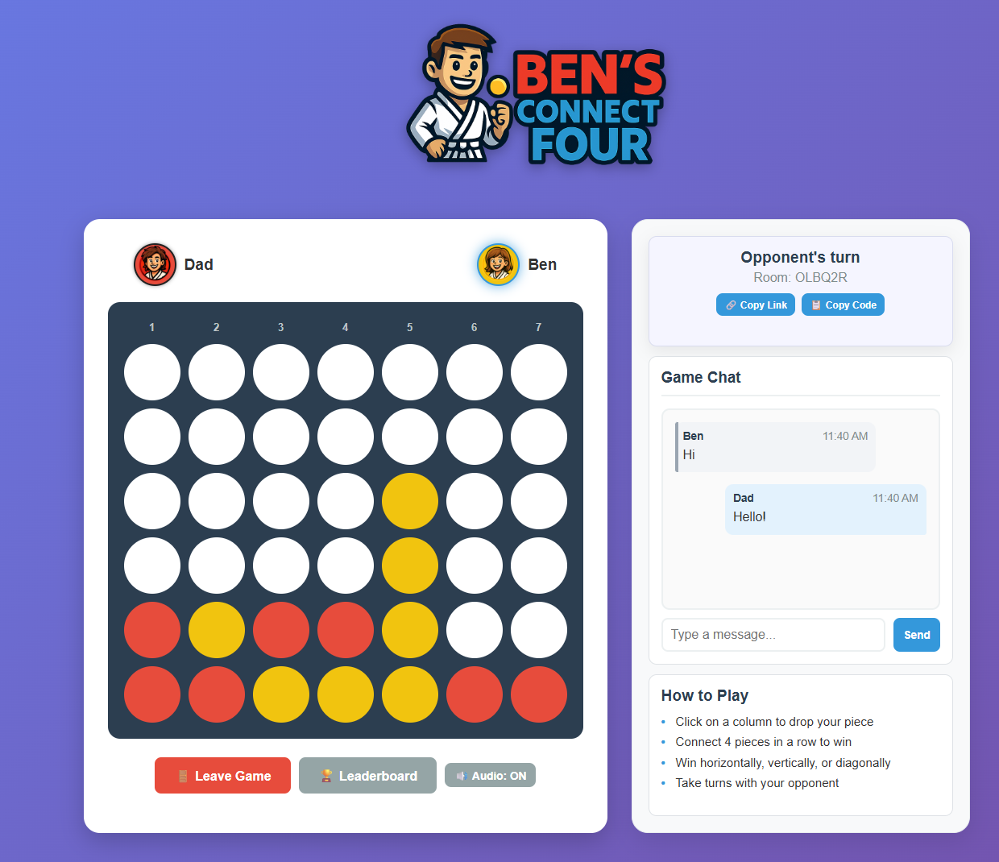

# Connect 4 - Online Multiplayer Game

A real-time, browser-based multiplayer Connect 4 game built with Node.js and Socket.IO. This project features a clean user interface, real-time chat (with typing indicator), character avatars, invite links, rematches, and a persistent leaderboard.

**🚀 Live Demo: [cdrz.app](https://cdrz.app)**

## Features

- 🎮 **Real-time Multiplayer:** Private online games with low-latency moves via Socket.IO.
- 🆔 **Prominent Room Code + Invite Links:** Copy the room code or a full auto-join link (includes optional host name).
- 🔗 **One‑Click Sharing:** Copy Link & Copy Code buttons surface immediately after creating/joining a game.
- 💬 **In-Game Chat:** Real-time messaging plus a subtle **typing indicator** for better conversational flow.
- 🧑‍🤝‍🧑 **Character Avatars:** Illustrated player tokens with active-turn glow (accessibility-friendly highlight).
- 🧠 **CPU Mode:** Quick single-player vs a simple AI when you just want a fast game.
- 🔄 **Rematch Flow:** Post-game rematch button with vote sync (starts when both players agree).
- � **Persistent Leaderboard:** Tracks wins, games played, and win rate across sessions.
- 🗂️ **Name Persistence:** Recently used player name auto-fills when opening an invite link.
    - Note: The invite link includes both `room` and a `host` param. The `host` value is displayed contextually ("Joining <host>'s game") but does not overwrite Player 2's own chosen name.
- 🎨 **Modern & Responsive UI:** Board + chat stay side-by-side on desktop; adaptive stacking for tablets & mobile.
- ✨ **Polished Feedback:** Animated piece drops, winning pulse, hover micro‑interactions, active avatar glow.
- 🔊 **Sound Effects:** Lightweight generated audio cues (drop, win, connect, chat) with toggle.
- 🛠️ **Straightforward Deployment:** No build step; deploy directly to Render / any Node host.

## How to Play

1. **Start a Game**: Click **New Online Game** (or play vs CPU with the CPU button).
2. **Invite a Friend**: Use Copy Link (auto-join deep link) or Copy Code from the status panel.
3. **They Join**: Your friend opens the link (room + host pre-filled) or clicks Join Online Game and enters the code.
4. **Chat & Play**: Turns alternate. First to connect four horizontally, vertically, or diagonally wins.
5. **Rematch**: After Game Over both players can request a rematch—starts automatically once both vote.

> Tip: The active player's avatar glows. The room code lives in the status panel above the chat so it's easy to copy and share.

## Visuals

### Screenshot



> Shows desktop layout with board, chat, avatars, invite controls, and status panel.

## Tech Stack

-   **Frontend**: HTML5, CSS3, Vanilla JavaScript (ES6+)
-   **Backend**: Node.js, Express
-   **Real-time Communication**: Socket.IO
-   **Hosting**: Deployed on [Render](https://render.com)

## Running Locally

### Prerequisites
-   Node.js (v16 or higher recommended)
-   npm (included with Node.js)

### Setup

1.  **Clone the repository:**
    ```bash
    git clone https://github.com/thecdrz/connect-four.git
    cd connect-four
    ```

2.  **Install dependencies:**
    ```bash
    npm install
    ```

3.  **Start the server:**
    ```bash
    npm start
    ```

4.  **Open in your browser:**
    -   Navigate to `http://localhost:3000`.
    -   Open a second browser tab or window to simulate a second player.

## Deployment

This application is configured for easy deployment on platforms like **Render**.

When deploying, ensure the host uses the `PORT` environment variable. The `server.js` is already configured to use `process.env.PORT`.

-   **Build Command**: `npm install`
-   **Start Command**: `npm start`

## Project Structure

```
/
├── public/             # Static assets (if any)
├── css/style.css       # All styling and animations
├── js/game.js          # Client-side game logic and Socket.IO handling
├── index.html          # Main HTML file for the game interface
├── server.js           # Node.js server with Express and Socket.IO
├── package.json        # Project dependencies and scripts
└── README.md           # This file
```

## License

This project is licensed under the MIT License. See the [LICENSE](LICENSE) file for details.

---

**Enjoy the game! 🎉**

---

## Visuals

### Screenshot


> Shows desktop layout with board, chat, avatars, invite controls, and status panel.

## Release Notes

### vNext (Current Main)
#### Added
- Invite link system with Copy Link & Copy Code buttons (auto-join via `?room=` + optional `host` param).
- Name persistence (localStorage) and auto-prefill when opening an invite link.
- Typing indicator with animated ellipsis in chat.
- Rematch flow: synchronized vote -> automatic board reset + fresh start events.
- CPU mode (single player) integrated alongside online mode selection.
- Deep status panel enhancements (visibility, consistent sizing) and inline invite actions.
- Improved Game Over modal with unified button layout and consistent sizing.
- Dynamic chat height management script to ensure chat never extends below board on desktop.

#### Changed
- Enlarged avatars (~+20%) and adjusted spacing; removed legacy color suffixes from names.
- Modal actions styled for clarity; rematch button uses gradient accent.
- Column headers centered & slimmed; tightened vertical whitespace for reduced scroll.
- Chat container uses responsive JS + CSS hybrid sizing (no layout push + smooth resize on window changes or content growth).
- Back button behavior in Join flow: after any failed room code attempt, Back now closes the modal instead of returning to the name step (faster recovery path).

#### Fixed
- CSS media query / brace mismatch that previously broke mobile styles.
- Layout wrapping issues—chat reliably remains to the right until breakpoint.
- Rapid successive room creation/join edge cases causing inconsistent button states.
- Initial multiplayer load where chat window could extend a few pixels below board before second player joined (now corrected immediately via `adjustChatHeight`).
- Join modal sometimes reopening on Back after invalid room codes; now closes cleanly once an error/attempt occurs.

#### Removed
- Legacy jukebox/audio UI panel (replaced by simple audio toggle).
- Experimental themed board/piece sprite test (reverted to cleaner default palette).

#### Upcoming (Backlog / Ideas)
- Spectator / observer mode.
- Dark / high-contrast + colorblind accessibility theme.
- Emoji reactions / lightweight emote bar.
- Optional QR code generator for invite link.
- Configurable CPU difficulty levels.

---

